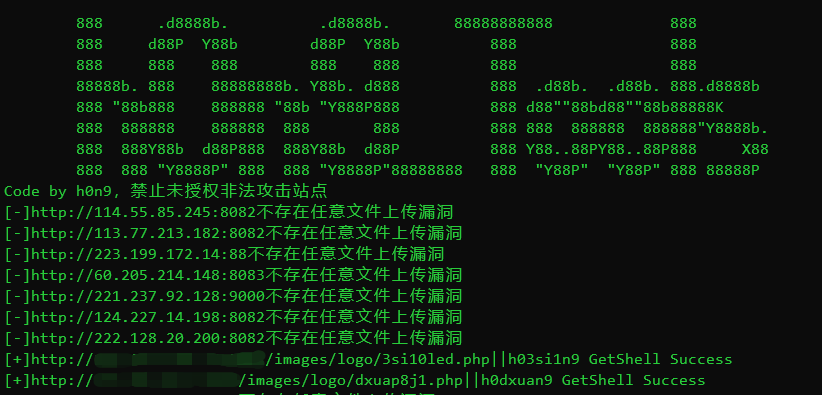
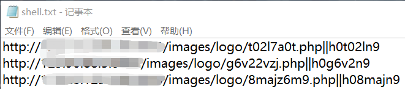
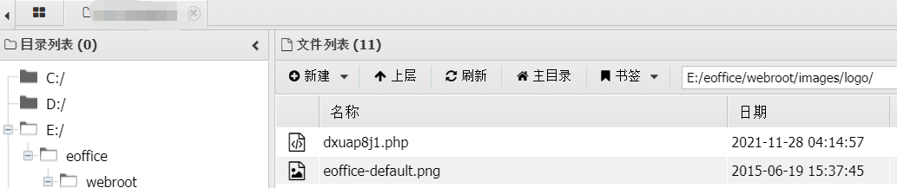

## e-officeGetShell

### 前提

请熟读[中华人民共和国网络安全法](http://mzj.cq.gov.cn/u/cms/cqyfyl/201910/18103505ap94.pdf)，仅限授权安全测试使用,禁止未授权非法攻击站点

### 使用方法

```shell
双击exe即可，会自动读取当前目录的url.txt，结果会保存在当前目录的shell.txt
```

### 使用截图





